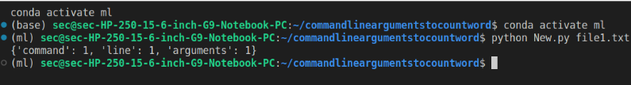

# command-line-arguments-to-count-word
## AIM:
To write a python program for getting the word count from the contents of a file using command line arguments.
## EQUIPEMENT'S REQUIRED: 
PC
Anaconda - Python 3.7
## ALGORITHM: 
### Step 1:

Import sys module to use command line arguments.
### Step 2:
Use the open() by getting the file name with "sys.argv[1]" which means the first index of given
argument.
### Step 3:
Iterate the content of the file using for loop.
### Step 4:
Split the contents into each line using .split() function.
### Step 5:
Iterate the list of lines and increment the value of variable (word) each time.

## PROGRAM:

```
'''
#program is developed: HARISH RAGAVENDRA S
# REF.NO: 22008967
'''
import sys
count= {}
with open(sys.argv[1],'r') as f:
    for line in f:
        for word in line.split():
            if word not in count:
                count[word]=1
            else:
                count[word]+=1
print("word count in file = ",count)
f.close()

```
### OUTPUT:


## RESULT:
Thus the program is written to find the word count from the contents of a file using command line arguments.
